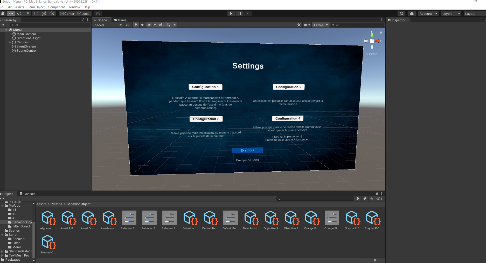
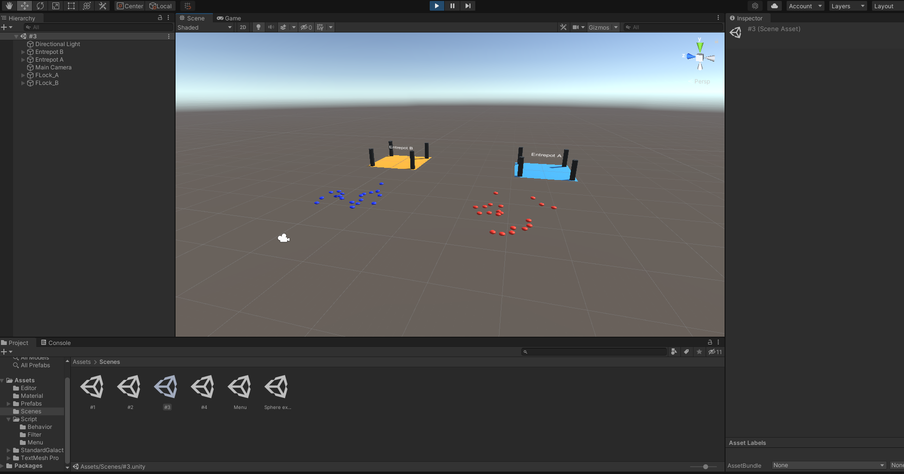

# Boids Repository

Adrien Ribeiro Pinto { M2 - ASPIC }

## Drones et essaims de Drones

* Le but de ce projet est de modéliser sous Unity le comportement de Boids (comportement vivant programmé artificiellement) dans un contexte particulier.
* __Contexte:__ Deux Entrepots (A, B) ont une demande de livraison de marcahndises au Magasins (A, B)
	et livrent leur marchandise grâce à des essaims de drones (A, B).
* Statut du projet: Prototype
* Université de Bordeaux

Objectifs:

* __Objectif 1:__ L'essaim A apporte la marchandise à l'entrepôt A pendant que l'essaim B livre le magasin B. Essaim B passe au dessus de l'essaim A (pas de communication).

* __Objectif 2:__ Un essaim est pilotable par un Joueur afin de remplir la même mission.

* __Objectif 3:__ Même principe mais les essaims se mettent d'accord sur la priorité de la hauteur.

* __Objectif 4:__ Même principe mais le deuxième essaim s'arrête pour laisser passer le premier essaim.
***
## Sommaire

> * [Boids Repository](#boids-repository)
>   * [Drones et essaims de Drones](#drones-et-essaims-de-drones)
>   * [Sommaire](#sommaire)
>   * [Installation](#installation)
>   * [Présentation](#presentation)
>     * [Screenshots](#screenshots)
>   * [Code](#code)
>     * [Editor](#editor)
>     * [Material](#material)
>     * [Prefabs](#prefabs)
>     * [Scenes](#scenes)
>     * [Script](#script)
>     * [Libs externes](#libs-externes)
>     * [Dépendances](#dependances)
>   * [Resources (Documentation and other links)](#resources-documentation-and-other-links)
>   * [Contributing / Reporting issues](#contributing--reporting-issues)
>   * [License](#license)
>   * [About Nuxeo](#about-nuxeo)
***
## Installation

    - Choose a folder to clone the project.
    - Open a comand line window in your folder's location.

    In Command line : 
        * git clone https://github.com/nighty33/Boids.git

    In Unity Hub :
        * Open -> Add project from Disk -> <PathToYourFolder>\Boids
***
## Presentation

Le projet est présenté dans la vidéo *"Demo.mkv"* qui se trouve à la racine du projet.

### Screenshots
Voici une capture du menu des configurations possibles.

Et voici un exemple de configuration.

***
## Code

Le projet est structuré comme suit:

* Editor
* Material
* Prefabs
    > * #1
    > * #2
    > * #3
    > * #4 (Not Yet Implemented)
    > * Behavior Object
    > * Filter Object
* Scenes
* Script
    > * Behavior
    > * Filter
    > * Menu
* External Lib(s)

### **Editor**

Cette partie n'est qu'une partie modification de l'affichage graphique (GUI) d'Unity.
Le dossier *Editor* contient le script permettant la modification de l'affichage du comportement appelé "CompositeBehavior" dans les "Prefabs".

### **Material**

Le dossier "Material" contient les différentes textures (couleurs/images) des objets utilisés dans ce projet.

### **Prefabs**

Cette partie contient les différents objets utilisés dans le projet.
Le dossier "Prefabs" contient 3 dossiers qui représentent les différents comportements des essaims de drones de chaque configuration.

Il contient aussi 2 dossiers, un comptenant les différents comportements de base (Behavior Object) et un comptenant les différents filtres (Filter Object) permettant de différencier les objets dans la simulation.

De plus le dossier (Material) contient les objets réutilisés dans chaque configuration (drones + entrepots).

### **Scenes**

Ce dossier "Scenes" contient les différentes scènes du projet, une pour chaque configuration ainsi qu'une pour le Menu du projet.

### **Script**

Cette partie contient les différents scripts utilisés dans le projet.

Le dossier "Script" contient 3 dossiers, "Behavior" spécifiant les différents comportements des boids (drones), les 3 principaux sont ceux de la direction commune (Alignement), du respect des distances de sécurité (Avoidance), et de la cohésion de groupe (Cohesion).

Le dossier des filtres "Filter" qui contient les scripts permettant de reconnaitre dans quel contexte l'essaim se situe (lui même/obstacle/etc).

Le dossier "Menu" qui s'occupe de changer de scène lorsque l'on appuie sur "Escape" en mode Play.

De plus le dossier (Script) contient les scripts gérant l'essaim (Flock) et les différents drones (FlockAgent) et les classes abstraites dont sont implémentés les scipts cités précédemment.

### Libs externes

Les libs utilisées sont utilisées pour changer la police du texte du "Menu" et n'ont rien à voir avec une quelconque dépendance sur le fonctionnement correct du projet (Boids).

### **Dependances**

* __Unity v.2020.3.23f1__

### **Limites du projet**

* La plus grosse limite est pour ma part la limite de connaissance d'Unity.
* Il y a aussi bien évidemment une limite de temps non négligeable

## Resources (Documentation and other links)

https://docs.unity3d.com/

https://youtube.com/playlist?list=PL5KbKbJ6Gf99UlyIqzV1UpOzseyRn5H1d

## Bugs / améliorations possibles

(Objectif 4)

Pour arréter l'essaim de drones (Flock) il faudrait enlever les comportements ou bien les changer une fois que l'on rencontre un autre essaim.